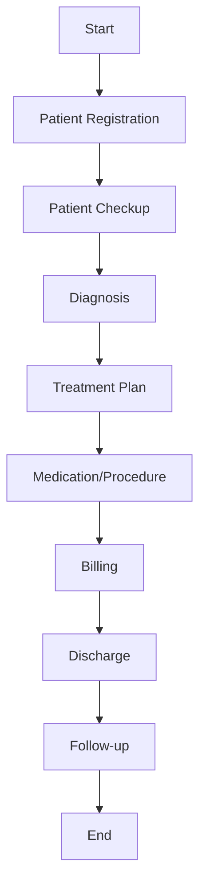

```markdown
# General Hospital Management System Flowchart


```mermaid
graph TD;
    A[Start] --> B[Patient Registration]
    B --> C[Patient Checkup]
    C --> D[Diagnosis]
    D --> E[Treatment Plan]
    E --> F[Medication/Procedure]
    F --> G[Billing]
    G --> H[Discharge]
    H --> I[Follow-up]
    I --> J[End]
```
```